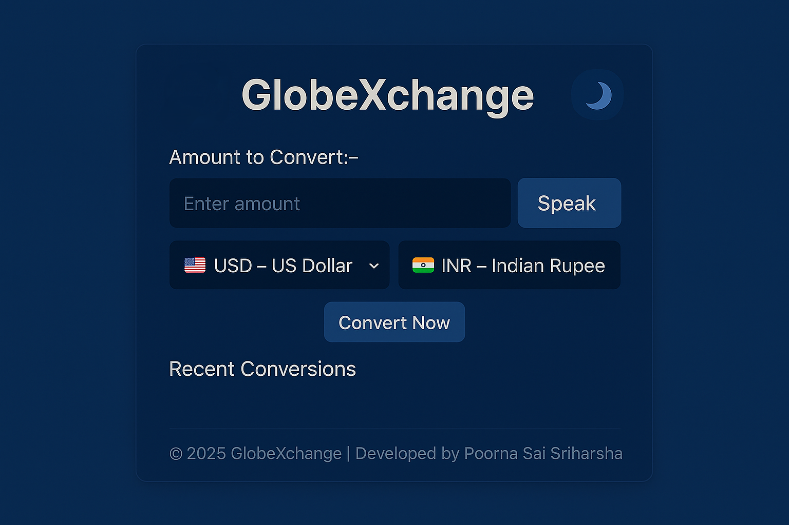

## 🌍 GlobeXchange
Developed "GlobeXchange" a currency conversion tool with real-time exchange rates, voice input, and dark/light mode. It allows users to select currencies and convert amounts seamlessly. The app features debounced conversion to optimize performance and stores the last five conversions for quick access. Built using HTML, CSS, and JavaScript, it integrates Speech Recognition API for voice input and fetches live rates via the Exchange Rate API. It’s designed for an intuitive, user-friendly experience.

## 📸 Screenshots

## ✨ Features
- ✅ Convert currencies in real-time using the ExchangeRate-API.
- 🎙️ Voice input support for entering amounts (works best in Chrome/Edge).
- 🔄 Dropdown menus for selecting source and target currencies (e.g., USD, INR, EUR).
- 📜 Track up to five recent conversions in a history list.
- 🌗 Toggle between light and dark themes for better usability.
- 📱 Responsive design for seamless use on mobile and desktop devices.
- 🔒 Prevent developer tools access (e.g., right-click, F12, Ctrl+U) for security.

## 🧠 How It Works
- Users enter an amount and select source and target currencies from dropdowns.
- The app fetches real-time exchange rates from the ExchangeRate-API.
- Conversions are displayed instantly with a debounced input for smooth performance.
- Voice input allows users to speak the amount, which is parsed to numbers.
- Recent conversions are stored and displayed in a list, limited to the last five entries.
- A theme toggle switches between light and dark modes, enhancing user experience.
- Security features block developer tools and right-click actions to protect the app.

## 🛠️ Built With
- HTML5
- CSS3 (Responsive Design, Theme Switching, Flexbox)
- JavaScript (ES6+, Async/Await for API calls)
- Font Awesome (https://fontawesome.com/) for icons
- ExchangeRate-API (https://www.exchangerate-api.com/) for currency data

## 🧰 Getting Started
- To run this project locally:
- Clone the repo: git clone https://github.com/Poorna-Sai-Sriharsha/GlobeXchange.git
- Navigate to the project directory: cd GlobeXchange
- Open index.html in a browser or use a local server (e.g., npx live-server) for the best experience.
- Note: No additional dependencies are required, as all libraries are included via CDNs.

## 🧪 Testing 
- Tested for compatibility across Chrome, Firefox, Safari, and Edge.
- Verified responsive design on mobile (iOS, Android) and desktop devices.
- Voice input tested in Chrome and Edge for optimal performance.

## 📖 What I Learned
- Integrated the ExchangeRate-API for real-time currency conversion.
- Implemented voice input using the Web Speech API with error handling.
- Mastered CSS custom properties for theme switching and responsive design.
- Enhanced JavaScript skills with async/await and debounced input handling.
= Learned to implement security measures to restrict developer tools access.

## 🤝 Contributing
- Contributions are welcome! Please fork the repository and submit a pull request with your changes. For major updates, open an issue first to discuss your ideas.

